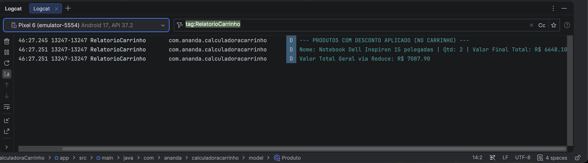

# Calculadora de Carrinho de Compras

Aplicativo Android desenvolvido utilizando Jetpack Compose, estruturado com arquitetura limpa em camadas, aplicando regras de negócio para cálculo de produtos, descontos e processamento de coleções via Logcat.

## Desenvolvedora
* **Nome Completo:** Ananda Cristine Rodrigues Mazine dos Santos

## Tecnologias e Requisitos Utilizados
* Linguagem Kotlin
* Jetpack Compose e Material Design 3
* Gerenciamento de Estado e Coleções Funcionais (Map, Filter, SortedByDescending)
* Tratamento de valores nulos (Null Safety) e truncamento de texto com reticências

## Capturas de Tela

### Interface do Aplicativo (Emulador)

### Relatório no Logcat

